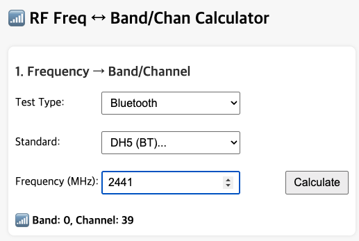
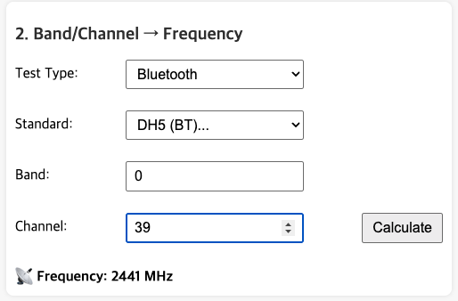

# 📡 RF Frequency ↔ Band/Channel Calculator

**Link**: http://freqcal.kro.kr/

A simple, web-based calculator for converting between RF frequency (MHz) and band/channel numbers, focused on Bluetooth (BT) and Wifi.

---

## ✨ Features

- 🔄 **Frequency → Band/Channel:**  
  Enter a frequency in MHz to get the corresponding band and channel.
- 🔄 **Band/Channel → Frequency:**  
  Enter a band and channel to get the corresponding frequency in MHz.
- 📶 Supports Bluetooth (BT) and Wifi.

---

## 🚀 Usage

1. **Open** `index.html` in your web browser.
2. Use the **first section** to convert from frequency to band/channel.
3. Use the **second section** to convert from band/channel to frequency.

---

## 💡 Result & Notification Messages

When you enter values and click the **Calculate** button, the calculator will display messages such as:

- ✅ **Calculation Result:**  
  Shows the calculated band/channel or frequency based on your input.
- ⚠️ **Invalid Input:**  
  If you enter an invalid frequency, band, or channel, a message will appear indicating the input is out of range or not supported.
- ℹ️ **Missing Input:**  
  If required fields are empty, a message will prompt you to enter the necessary values.

These messages help guide you to enter correct values and understand the calculation results.

---

## 📋 Supported Bands & Channels

### Bluetooth (BT)

| Standard | Band | Channel Range | Frequency Range (MHz) |
| -------- | ---- | ------------- | --------------------- |
| DH5      | 0    | 0 ~ 78        | 2402 ~ 2480           |
| BLE      | 0    | 0 ~ 39        | 2402 ~ 2480           |
| DH5      | 1    | 0 ~ 100       | 5150 ~ 5250           |
| BLE      | 1    | 0 ~ 50        | 5150 ~ 5250           |
| DH5      | 2    | 0 ~ 125       | 5725 ~ 5850           |
| BLE      | 2    | 0 ~ 62        | 5725 ~ 5850           |
| DH5      | 4    | 0 ~ 125       | 5925 ~ 6050           |
| BLE      | 4    | 0 ~ 62        | 5925 ~ 6050           |
| DH5      | 5    | 0 ~ 124       | 6051 ~ 6175           |
| BLE      | 5    | 0 ~ 62        | 6051 ~ 6175           |
| DH5      | 6    | 0 ~ 124       | 6176 ~ 6300           |
| BLE      | 6    | 0 ~ 62        | 6176 ~ 6300           |
| DH5      | 7    | 0 ~ 124       | 6301 ~ 6425           |
| BLE      | 7    | 0 ~ 62        | 6301 ~ 6425           |

### WiFi

| Band    | Channel Range | Frequency Range (MHz) |
| ------- | ------------- | --------------------- |
| 2.4 GHz | 1 ~ 15        | 2412 ~ 2484           |
| 5 GHz   | 0 ~ 180       | 5000 ~ 5900           |
| 6 GHz   | 0 ~ 220       | 5950 ~ 7050           |

> Table info may differ by implementation or standard.

---

## 🗂️ Project Structure

```
index.html      # Main HTML file
style.css       # Stylesheet
script.js       # Calculator logic (JavaScript)
CNAME           # (Optional) Custom domain for GitHub Pages
```

---

## 📝 Example

- **Frequency → Band/Channel:**  
  Enter `2441` MHz (Bluetooth, DH5) → Band: `0`, Channel: `39`
  
- **Band/Channel → Frequency:**  
   Enter Band: `0`, Channel: `39` (Bluetooth, DH5) → Frequency: `2441` MHz
  
- Invalid value
  
- Empty value
  
